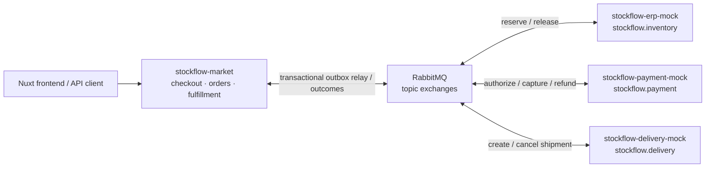
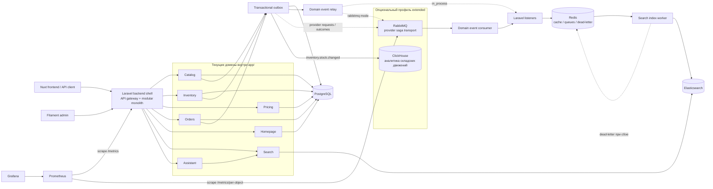
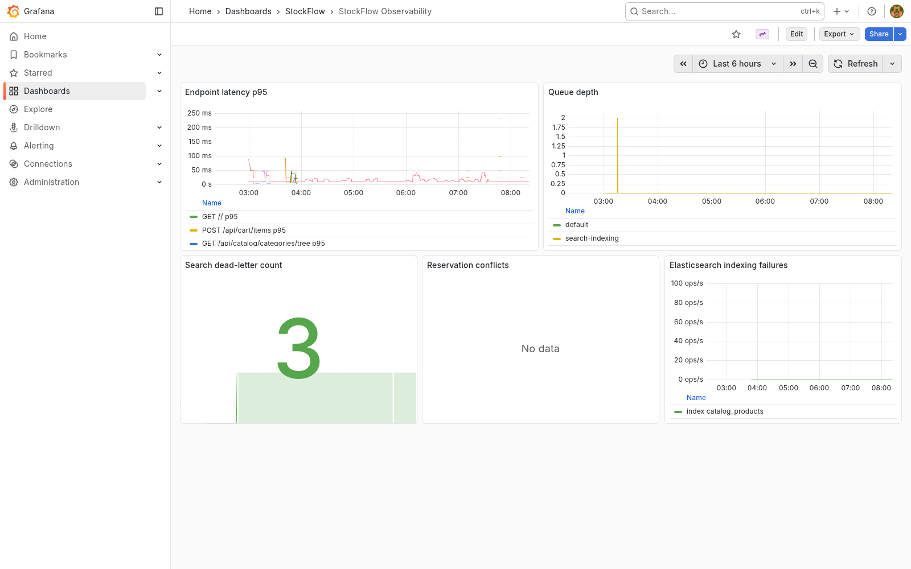
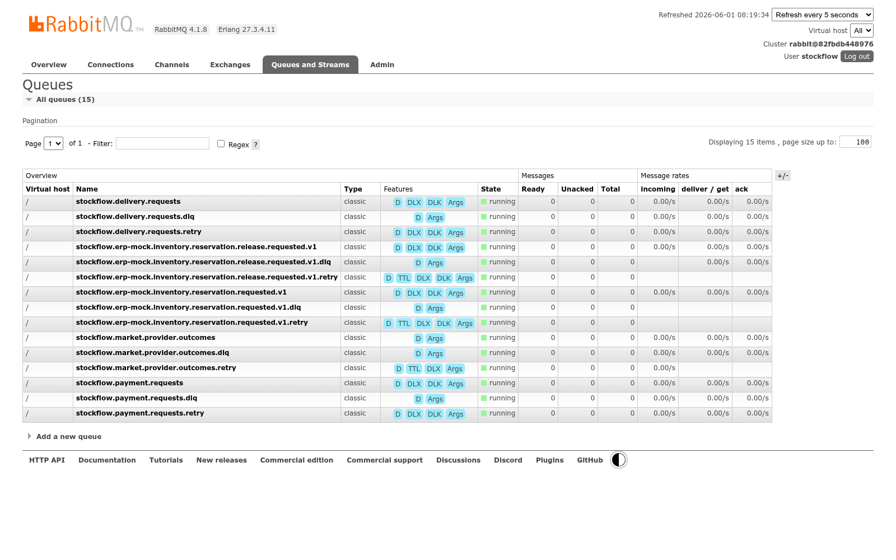

# StockFlow Market

StockFlow Market — инженерный pet-проект маркетплейса с микросервисным направлением вокруг Laravel, PostgreSQL, Redis, RabbitMQ, Elasticsearch, ClickHouse и Nuxt SSR frontend. Проект развивается как backend-case с акцентом на высокую нагрузку: в нём последовательно прорабатываются каталог, остатки, заказы, цены, поиск, асинхронные события и локальная инфраструктура. Сейчас это фундамент и набор сквозных backend-срезов, а не завершённая production-система или готовый микросервисный маркетплейс.

## Что демонстрирует проект

- Умение провести бизнес-сценарий checkout через границы четырёх независимо
  запускаемых систем: market-orchestrator, ERP/WMS, payment и delivery provider
  sandbox.
- Практическую работу с transactional outbox, inbox-дедупликацией,
  at-least-once delivery, retry queues, DLQ, ручным requeue и saga-
  компенсациями.
- Разделение хранилищ по назначению: PostgreSQL для транзакций, Redis для кеша
  и очередей, Elasticsearch для поиска, ClickHouse для аналитической витрины
  складских движений.
- Приближенную к production эксплуатационную поверхность: readiness probes,
  Prometheus-метрики и alert rules, Grafana dashboard, fault injection,
  DLQ-runbook, воспроизводимый broker-level E2E и регрессионный baseline k6.
- Provider-независимый AI-ассистент, который ищет товары через каталог и
  возвращает карточки только для подтверждённых результатами поиска ID.
- Осознанные ограничения: это локальный Docker Compose стенд и инженерный case,
  а не заявление о production capacity или exactly-once обработке.

Подтверждённые локальные цифры:

| Измерение | Результат | Контекст |
| --- | ---: | --- |
| HTTP throughput | `50.52 req/s` | Смешанный профиль k6: catalog browse, reservation race, search и checkout burst |
| Request duration p95 | `8.17s` | Точка насыщения одиночного локального gateway; порог `750ms` нарушен |
| Нагрузочный dataset | `1` товар, `1` retail price, `100000` единиц остатка, `4` search queries | Явно подготовленный минимальный dataset; catalog browse использовал диапазон из `8` страниц по `20` товаров |
| Максимум активных VUs | `409` из `410` | Локальный k6 baseline от `2026-06-01` |
| Provider saga queue drain | `0–1s` | Три успешных broker-level E2E-прогона от confirm до `completed`, по timestamp PostgreSQL с точностью до секунды |

Источники: [k6 baseline](tests/load/k6/results/2026-06-01-local-baseline.md),
[broker-level E2E](scripts/test-broker-checkout-e2e.sh) и
[failure scenarios](docs/failure-modes.md). Queue drain не является SLA: при
повторной локальной проверке `2026-06-02` один из трёх последовательных
прогретых прогонов попал в `stockflow.payment.requests.dlq`, поэтому sandbox-
контур сохраняет отдельный операционный сценарий диагностики и requeue.

## Гарантии и компромиссы

| Механизм | Что гарантируется | Цена и граница гарантии |
| --- | --- | --- |
| At-least-once delivery | Durable RabbitMQ queues, retry queues и publisher confirms повторно доставляют provider requests и outcomes до успешной обработки или попадания в DLQ | Exactly-once не обещается: consumers обязаны выдерживать дубликаты |
| Idempotency | Market дедуплицирует outcomes через inbox по `message_id`, переходы saga идемпотентны; provider sandbox-сервисы защищают повторные side effects | Нужны стабильные idempotency keys, хранение обработанных сообщений и политика очистки |
| Eventual consistency | Confirm быстро переводит заказ в промежуточное состояние, а workers доводят reserve, authorize, capture и shipment асинхронно | Клиент должен учитывать промежуточные статусы; мгновенной согласованности между сервисами нет |
| Compensation | При сбое saga запускает release, refund и shipment cancel в зависимости от уже выполненных шагов | Компенсация является отдельной распределённой операцией и тоже может потребовать retry или ручного разбора |
| DLQ | Отдельные DLQ сохраняют необработанные provider requests, outcomes и документы поисковой индексации для диагностики и контролируемого requeue | DLQ не исправляет причину сбоя автоматически: нужен runbook и операторское решение |

## Экосистема StockFlow

`stockflow-market` — основной репозиторий и точка входа в экосистему. Вокруг него
подготовлены три независимых sandbox-сервиса для интеграции через RabbitMQ:

| Репозиторий | RabbitMQ exchange | Ответственность |
| --- | --- | --- |
| **[stockflow-market](https://github.com/Smiley-Alyx/stockflow-market)** | orchestration boundary | Checkout, заказы, каталог и оркестрация provider-событий |
| [stockflow-erp-mock](https://github.com/Smiley-Alyx/stockflow-erp-mock) | `stockflow.inventory` | Резервирование и освобождение складских остатков |
| [stockflow-payment-mock](https://github.com/Smiley-Alyx/stockflow-payment-mock) | `stockflow.payment` | Авторизация, capture и refund платежей |
| [stockflow-delivery-mock](https://github.com/Smiley-Alyx/stockflow-delivery-mock) | `stockflow.delivery` | Создание, отмена и изменение статуса отправлений |



Provider sandbox-сервисы реализуют версионированные AsyncAPI-контракты,
idempotency, retry, DLQ, failure injection и correlation headers. В
`stockflow-market` provider saga
публикует requests через transactional outbox relay, дедуплицирует outcomes через
inbox и выполняет компенсации release, refund и shipment cancel.

| Документ | Содержание |
| --- | --- |
| [`docs/architecture.md`](docs/architecture.md) | Контекст четырёх систем, границы интеграции и компромиссы |
| [`docs/delivery-flow.md`](docs/delivery-flow.md) | Сквозная checkout-последовательность и компенсирующие действия |
| [`docs/failure-modes.md`](docs/failure-modes.md) | Сценарии отказов и таблица гарантий |
| [`docs/catalog-demo.md`](docs/catalog-demo.md) | Демонстрация outbox, индексации, search dead-letter и requeue |
| [`docs/checkout-demo.md`](docs/checkout-demo.md) | Пошаговая демонстрация checkout и асинхронного резервирования |
| [`docs/api-examples.md`](docs/api-examples.md) | Минимальные примеры запросов к публичному API |
| [`docs/domain-event-transport.md`](docs/domain-event-transport.md) | RabbitMQ transport доменных событий, retry и повторная доставка |
| [`docs/provider-outcome-dlq-runbook.md`](docs/provider-outcome-dlq-runbook.md) | Поиск, диагностика и requeue provider outcome DLQ |
| [`docs/alerting.md`](docs/alerting.md) | Prometheus alert rules, пороги и порядок диагностики |
| [`docs/ai-assistant-providers.md`](docs/ai-assistant-providers.md) | Подключение OpenAI, GigaChat, Yandex AI и других AI-провайдеров |
| [`docs/assistant-evals.md`](docs/assistant-evals.md) | Eval-набор, метрики grounding и сравнение AI-конфигураций |
| [`docs/operational-security.md`](docs/operational-security.md) | Ротация секретов, RabbitMQ permissions и supply-chain проверки |
| [`docs/backup-restore.md`](docs/backup-restore.md) | Backup-стратегия и автоматический restore drill PostgreSQL, RabbitMQ и ClickHouse |
| [`docs/demo.md`](docs/demo.md) | Пятиминутный сценарий демонстрации техлиду |

## Текущий статус

Сейчас проект представляет рабочий локальный интеграционный стенд и набор
сквозных backend-срезов:

- поднят Laravel backend shell, который временно выполняет роль API gateway;
- добавлен Docker Compose для локального запуска инфраструктуры;
- заведён `services/` workspace под будущие сервисы;
- зафиксированы первые OpenAPI-заготовки и события по доменам;
- реализована модель Catalog: категории, товары, атрибуты, кешируемая read-модель и команда перестроения проекций;
- добавлена Filament-панель для управления каталогом, складами, остатками, ценами и промокодами;
- добавлены настраиваемые блоки главной страницы: рекомендации, хиты, новинки, описание, города и баннеры с управляемым порядком;
- склады дополнены координатами для списка городов и точек на карте;
- добавлена внутренняя публикация `catalog.product.created`;
- добавлен обработчик, который превращает создание товара в `search.index.requested`;
- добавлен первый async job pipeline для индексации поисковых документов;
- добавлены Docker Compose worker-процессы для общей очереди, поисковой индексации и scheduler;
- добавлены `health/live` и `health/ready` probes для runtime и зависимостей;
- подключён Elasticsearch adapter для записи поисковых документов;
- добавлен первый search read endpoint поверх Elasticsearch для индексированных товаров;
- добавлен локальный ClickHouse с аналитической витриной складских движений;
- реализован checkout-срез `cart → draft order → price snapshot → async inventory reservation → paid / cancelled / expired`;
- добавлена provider saga `reserve → authorize → capture → shipment` с outbox relay, inbox-дедупликацией и компенсациями;
- checkout read-модель проецирует статусы резервов из RabbitMQ outcomes и доступна через `GET /api/orders/{id}/checkout`;
- межсервисные доменные события публикуются в RabbitMQ через outbox relay и потребляются с inbox-дедупликацией, retry и DLQ;
- payload каждого доменного события зафиксирован отдельной JSON Schema;
  producer/consumer contract tests и CI-проверка обратной совместимости
  защищают эволюцию событий от breaking changes;
- добавлены маршрутизация резервов по складам, архивирование складских движений и географический фильтр остатков;
- цены поддерживают городские переопределения, версии, интервалы активности и промокоды; заказ сохраняет снимок выбранной цены и скидки;
- добавлена scheduled-команда истечения активных inventory-резервов с метрикой количества истёкших резервов;
- добавлена операционная команда `search:dead-letter` для просмотра и ручного возврата документов поисковой индексации из отдельного dead-letter backend;
- поиск умеет возвращать деградированный ответ при недоступности Elasticsearch;
- добавлен Prometheus-compatible `/metrics` endpoint и локальный Prometheus/Grafana стек для latency, очередей, dead-letter, reservation conflicts, saga outcomes, компенсаций и stale messaging claims;
- Prometheus собирает per-object метрики RabbitMQ и загружает проверяемые
  `promtool` warning/critical rules для роста DLQ, ready/unacked backlog
  очередей и HTTP p95/p99 latency;
- Alertmanager доставляет firing/resolved уведомления в локальный webhook-
  receiver с доступной для проверок историей;
- автоматизированный failure drill воспроизводит рост DLQ, остановку consumer,
  RabbitMQ outage и высокую latency, проверяя доставку и восстановление alerts;
- CI выполняет backend dependency audit, формирует SBOM, сканирует backend image
  и регулярно проверяет восстановление PostgreSQL, RabbitMQ и ClickHouse из backup;
- provider-backed AI-ассистент использует `search_catalog`, структурированный
  ответ и серверную проверку выбранных product ID; старый браузерный
  эвристический подбор удалён;
- eval-набор AI-ассистента фиксирует допустимые и запрещённые рекомендации,
  проверяет grounding, релевантность и карточки и сравнивает provider/model/prompt;
- добавлен `config/stockflow.php` для runtime-настроек таймаутов, кеша, очередей, retry и backpressure limits;
- описан первый ADR по переходной архитектуре Laravel gateway + service workspace;
- добавлен архитектурный тест, который проверяет наличие сервисной структуры.

## Архитектура

Целевое направление — микросервисный marketplace, где каждый сервис владеет своей моделью, контрактами и схемой данных. На раннем этапе реализация остаётся в одном репозитории, чтобы быстрее развивать сценарии и не платить стоимость распределённой системы до появления реальной доменной нагрузки.



```text
stockflow-market/
  app/                    # Laravel backend shell / gateway на текущем этапе
  services/
    gateway/              # внешний API слой
    catalog/              # товары, категории, атрибуты
    inventory/            # остатки, резервы, складские движения
    orders/               # корзина и жизненный цикл заказа
    pricing/              # цены, промо-правила, расчёты
    search/               # Elasticsearch индексы и read-модели
  docker/
    php/                  # локальный PHP runtime
  compose.yaml            # локальный стек разработки
```

Каждый доменный сервис уже содержит одинаковые рабочие зоны:

- `contracts/` — OpenAPI и внешние контракты;
- `database/migrations/` — будущая схема данных сервиса;
- `messaging/` — входящие и исходящие события;
- `src/` — прикладной и доменный код;
- `tests/` — модульные, контрактные и интеграционные проверки.

## Локальная инфраструктура

Базовый `docker compose up` поднимает только обязательные компоненты. RabbitMQ и ClickHouse вынесены в опциональный профиль `extended`: они добавляют provider saga и аналитическую витрину складских движений, но не являются обязательными зависимостями рабочего backend-среза.

| Сервис | Назначение | Режим запуска | Локальный адрес |
| --- | --- | --- | --- |
| `php` | Laravel backend shell | базовый | `http://localhost:8080` |
| `frontend` | Nuxt SSR dev server | базовый | `http://localhost:3000` |
| `swagger-ui` | интерактивная документация gateway API | базовый | `http://localhost:8084` |
| `postgres` | основная реляционная БД | базовый | `localhost:5432` |
| `redis` | кеш, сессии, очереди | базовый | `localhost:6379` |
| `elasticsearch` | поисковый движок | базовый | `http://localhost:9200` |
| `prometheus` | сбор метрик gateway | базовый | `http://localhost:9090` |
| `alertmanager` | группировка и доставка alerts | базовый | `http://localhost:9093` |
| `alert-webhook` | локальная история firing/resolved уведомлений | базовый | `http://localhost:9081/events` |
| `grafana` | дашборды наблюдаемости | базовый | `http://localhost:3001` |
| `rabbitmq` | transport для provider saga и доменных событий | `extended` | `localhost:5672`, UI `http://localhost:15672` |
| `clickhouse` | аналитическая витрина складских движений | `extended` | HTTP `http://localhost:8123`, native `localhost:9000` |

## Сценарии инфраструктуры

| Компонент | Демонстрируемый сценарий | Статус |
| --- | --- | --- |
| PostgreSQL | транзакционные данные каталога, складов, цен, корзин, заказов, outbox и inbox | используется |
| Redis | кеш каталога, Laravel queues, сессии и search dead-letter storage | используется |
| Elasticsearch | индексация каталога, поисковый read endpoint и деградированный ответ при недоступности | используется |
| Prometheus | gateway/RabbitMQ scrape и warning/critical rules для DLQ, backlog очередей и HTTP tail latency | используется |
| Grafana | автоматически provisioned dashboard `StockFlow Observability` поверх Prometheus | используется |
| RabbitMQ | provider saga и transport доменных событий с outbox/inbox, retry и DLQ | профиль `extended`, используется |
| ClickHouse | витрина `inventory_stock_movements`, заполняемая из outbox-событий с inbox-защитой от повторной доставки | профиль `extended`, используется |

Расширенный профиль запускается явно:

```bash
RABBITMQ_ENABLED=true CLICKHOUSE_ENABLED=true docker compose --profile extended up -d
```

Backend использует in-process публикацию общих доменных outbox-событий по
умолчанию. В общем стенде `STOCKFLOW_EVENT_BUS=rabbitmq` переключает relay на
topic exchange `stockflow.domain.events`; отдельный consumer обрабатывает
события с inbox-дедупликацией, TTL retry queue и DLQ.
Checkout всегда запускает provider saga: reservation requests и outcomes идут
через отдельный RabbitMQ transport, а gateway читает их асинхронную проекцию.

При включённом `CLICKHOUSE_ENABLED=true` обработчик `inventory.stock.changed`
проецирует каждое складское движение в ClickHouse. Для первоначального
наполнения или полного восстановления витрины из горячего журнала и PostgreSQL-
архива используется команда:

```bash
docker compose exec php php artisan analytics:stock-movements:rebuild
```

Все четыре репозитория можно поднять на одном RabbitMQ одной командой:

```bash
docker compose -f docker-compose-all.yml up -d --build
```

В общем стенде gateway остаётся на `http://localhost:8080`, payment sandbox
доступен на `http://localhost:8081`, delivery sandbox — на
`http://localhost:8082`, ERP sandbox — на `http://localhost:8083`. Подробности
и команды проверки собраны в
[`docs/demo.md`](docs/demo.md).

Автономный broker-level E2E тест поднимает market, три provider sandbox-сервиса
и RabbitMQ, прогоняет checkout, повторную доставку доменных событий, retry/DLQ
и останавливает созданные контейнеры:

```bash
./scripts/test-broker-checkout-e2e.sh
```

Для уже запущенного стенда повторную доставку доменных событий можно проверить
отдельно:

```bash
./scripts/test-domain-event-redelivery-e2e.sh
```

Воспроизводимый сценарий `создать товар → событие → индексация → поиск → dead-letter/requeue` описан в [`docs/catalog-demo.md`](docs/catalog-demo.md).

Законченный бизнес-сценарий `корзина → price snapshot → reserve stock → order created` описан в [`docs/checkout-demo.md`](docs/checkout-demo.md).

Минимальные примеры API через `curl` и `httpie` собраны в [`docs/api-examples.md`](docs/api-examples.md).

Дефолтные локальные креды:

```text
PostgreSQL: stockflow / secret
RabbitMQ:   stockflow / secret
ClickHouse: stockflow / secret
```

Общий стенд из `docker-compose-all.yml` использует для RabbitMQ креды
`stockflow / stockflow`, одинаковые для marketplace и трёх provider sandbox-
сервисов.

## Быстрый старт

```bash
cp .env.example .env
docker compose up -d --build
docker compose exec php composer install
docker compose exec php php artisan key:generate
docker compose exec php php artisan migrate
docker compose exec php php artisan db:seed
```

`db:seed` создает каталог из 50 000 товаров, склады, цены и контент главной
страницы. Серийные товары воспроизводимо распределены по цветам, размерам,
ценовым диапазонам, категориям и брендам. Массовые записи создаются chunked
upsert-операциями, поэтому seeder не держит весь каталог в памяти.

Объём можно изменить через `STOCKFLOW_SEED_PRODUCT_COUNT`. Минимум — 20
детализированных витринных товаров:

```dotenv
STOCKFLOW_SEED_PRODUCT_COUNT=50000
```

При `STOCKFLOW_SEED_SEARCH_INDEX=true` после наполнения весь каталог ставится в
очередь индексации Elasticsearch. Для отдельной быстрой проверки PostgreSQL
наполнение можно запустить с `STOCKFLOW_SEED_SEARCH_INDEX=false`. Прогресс
индексации виден через `docker compose logs -f search-index-worker`.

Для полной переиндексации большого каталога без промежуточной очереди используйте
bulk-режим. Команда завершится с ошибкой, если Elasticsearch отклонит хотя бы
один документ. Timeout bulk-запроса настраивается отдельно через
`STOCKFLOW_SEARCH_INDEX_BULK_TIMEOUT_MS`:

```bash
docker compose exec php php artisan search:index:rebuild --sync --chunk=500
curl -fsS http://localhost:9200/catalog_products/_count
```

После базового запуска:

- backend доступен на `http://localhost:8080`;
- frontend доступен на `http://localhost:3000`;
- Swagger UI для gateway API доступен на `http://localhost:8084`;
- Prometheus доступен на `http://localhost:9090`;
- Alertmanager доступен на `http://localhost:9093`;
- локальный receiver уведомлений доступен на `http://localhost:9081/events`;
- Grafana доступна на `http://localhost:3001` с кредами `stockflow / stockflow`.

После запуска профиля `extended` RabbitMQ Management UI доступен на `http://localhost:15672`.

## Локальные команды

```bash
composer install-git-hooks
composer test
docker compose config
docker compose ps
docker compose logs -f php
docker compose down
```

`composer test` запускает локальный PHP, если есть подходящий PDO-драйвер. При наличии `pdo_sqlite` используется in-memory SQLite; если локально доступен только `pdo_pgsql`, тесты переключаются на PostgreSQL с дефолтными локальными кредами `stockflow / secret`. Если локальный PHP не подходит, wrapper запускает suite внутри `docker compose run php`.

`composer install-git-hooks` включает проектные git hooks и шаблон commit message. Сообщение коммита обязано соответствовать Conventional Commits в формате `type(scope): subject`, где `scope` обязателен и пишется в kebab-case.

Примеры:

- `feat(order-matching): introduce async matching pipeline`
- `refactor(cache): extract redis abstraction layer`
- `perf(ws): reduce allocations in market broadcast loop`
- `test(load): add k6 scenario for burst traffic`
- `docs(adr): describe event-driven matching architecture`
- `infra(observability): add prometheus and grafana stack`

## Настройки runtime

Настройки для сценариев высокой нагрузки собраны в `config/stockflow.php`, чтобы прикладной код не хардкодил операционные лимиты. Значения переопределяются через переменные `STOCKFLOW_*` в `.env`.

| Группа | Назначение |
| --- | --- |
| `runtime` | имя сервиса, общий request timeout, graceful shutdown budget |
| `dependencies` | адреса RabbitMQ, Elasticsearch и ClickHouse для health checks и адаптеров |
| `catalog.cache` | TTL кеша товаров и дерева категорий |
| `search.indexing` | очередь индексации, Redis dead-letter backend, requeue audit channel, batch size, max in-flight, timeout Elasticsearch |
| `messaging.retry` | retry attempts, backoff и порог dead-letter |

Эти настройки задают операционные границы для кеша каталога, Elasticsearch adapter, retries и backpressure. Очередь `search-indexing` уже используется job pipeline для поисковой индексации, а окончательно упавшие документы сохраняются в Redis-backed dead-letter storage с operational name `search-indexing-dead-letter`.

## AI-ассистент

Nuxt отображает один provider-backed AI-виджет. Backend выбирает адаптер через
`AI_ASSISTANT_PROVIDER`; OpenAI используется по умолчанию, а для GigaChat и
Yandex AI предусмотрены конфигурационные точки расширения.

Для рекомендаций адаптер обязан вызвать `search_catalog`. Финальный ответ
содержит текст и выбранные `product_ids`; перед возвратом клиенту backend
пересекает их с фактическими результатами поиска. Это не позволяет
промежуточным или выдуманным ID попасть в карточки товаров. Настройка новых
провайдеров описана в
[`docs/ai-assistant-providers.md`](docs/ai-assistant-providers.md).

## Наблюдаемость

Gateway отдаёт Prometheus text exposition на:

```bash
curl http://localhost:8080/metrics
```

Локальный Prometheus scrape-ит endpoint `php:8000/metrics` и RabbitMQ
`rabbitmq:15692/metrics/per-object` каждые 15 секунд. Grafana автоматически
подхватывает datasource `Prometheus` и dashboard `StockFlow Observability`.

Экспортируемые метрики:

| Метрика | Тип | Назначение |
| --- | --- | --- |
| `stockflow_http_request_duration_seconds` | histogram | latency по HTTP method, route endpoint и status |
| `stockflow_queue_depth` | gauge | глубина очередей `default` и `search-indexing` |
| `stockflow_search_dead_letter_count` | gauge | количество документов в search indexing dead-letter |
| `stockflow_dependency_enabled` | gauge | включён ли RabbitMQ как обязательная runtime-зависимость |
| `stockflow_inventory_reservation_conflicts_total` | counter | конфликты резервирования по причине `idempotency` / `insufficient_stock` |
| `stockflow_search_indexing_failures_total` | counter | окончательные ошибки Elasticsearch indexing/delete по index и operation |
| `stockflow_checkout_sagas_total` | counter | результаты provider saga |
| `stockflow_checkout_saga_compensations_total` | counter | запрошенные и завершённые компенсации saga |
| `stockflow_messaging_stale_claim_recoveries_total` | counter | восстановленные stale claims inbox/outbox |

Dashboard содержит панели для p95 latency по endpoint, глубины очередей,
dead-letter count, reservation conflicts rate и Elasticsearch indexing failures
rate. Prometheus загружает warning/critical rules для роста DLQ, полного
ready/unacked backlog очередей и HTTP p95/p99 latency. Пороги и порядок
проверки описаны в [`docs/alerting.md`](docs/alerting.md).

### Снимки экрана локального стенда

Grafana dashboard `StockFlow Observability` после запуска локального стенда:



RabbitMQ Management UI с основными, retry и DLQ-очередями provider saga:



## Операции с search dead-letter

Документы, которые не удалось проиндексировать после retry-порога, сохраняются в Redis-backed dead-letter хранилище. Это приближает локальный контур к production-подобному операционному сценарию, но не заменяет проверку под реальной нагрузкой и отказами. По умолчанию используется ключ `stockflow:search:dead-letter`; CLI-контракт остаётся прежним: оператор работает с числовым `ID`, фильтрами и теми же action `list` / `requeue`.

```bash
php artisan search:dead-letter list
php artisan search:dead-letter list --limit=50
php artisan search:dead-letter list --index=catalog_products --document-id=15
```

Возврат одного документа в основную очередь индексации:

```bash
php artisan search:dead-letter requeue --id=123
```

Защищённый bulk requeue для production-подобных сценариев:

```bash
php artisan search:dead-letter requeue --all --index=catalog_products --dry-run
php artisan search:dead-letter requeue --all --index=catalog_products --document-id=15 --dry-run
php artisan search:dead-letter requeue --all --index=catalog_products
php artisan search:dead-letter requeue --all --index=catalog_products --force
php artisan search:dead-letter requeue --all --index=catalog_products --batch-size=50 --force
```

Защитные правила:

- `requeue` требует `--id` или явный `--all`;
- `--dry-run` показывает найденные документы и не меняет очереди;
- bulk requeue без `--force` требует интерактивного подтверждения;
- bulk requeue обрабатывает документы страницами по `ID` и чанками не больше `STOCKFLOW_SEARCH_MAX_REQUEUE_BATCH_SIZE`;
- `--index` и `--document-id` сужают выборку перед requeue;
- каждый реально возвращённый документ пишет структурированное audit-событие `search.dead_letter.requeued` в канал `STOCKFLOW_SEARCH_REQUEUE_AUDIT_CHANNEL`, чтобы его можно было отдельно направлять в SIEM.

## Истечение inventory-резервов

Активные резервы остатков истекают через scheduled job. В локальном Docker Compose за это отвечает сервис `scheduler`, который запускает Laravel scheduler через `php artisan schedule:work`. Scheduler каждую минуту выполняет:

```bash
php artisan inventory:reservations:expire
```

Команду можно запускать вручную для операционной проверки или разовой очистки. После каждого запуска она пишет структурированное log-событие `inventory.reservations.expired` с полем `expired_count`, чтобы количество истёкших резервов можно было собирать как метрику.

## Проверки

Основная проверка на текущем этапе:

```bash
composer test
```

GitHub Actions workflow `.github/workflows/ci.yml` для каждого push и pull
request запускает `composer test`, `vendor/bin/pint --test`,
`docker compose config --quiet`, frontend typecheck/build и проверки
Prometheus-конфигурации и alert rules через `promtool`. Отдельные jobs проверяют
baseline AI-ассистента, supply chain и обратную совместимость доменных событий.

Broker-level checkout E2E клонирует market и три provider sandbox-репозитория,
поднимает чистый общий RabbitMQ-стенд, проверяет provider saga и повторную
доставку доменных событий и сохраняет Docker-логи как artifact при сбое.
Отдельные тяжёлые jobs проверяют доставку operational alerts и восстановление
PostgreSQL, RabbitMQ и ClickHouse из резервных копий. Они запускаются на push в
`main`, вручную через `workflow_dispatch` и ежедневно по расписанию.

Тесты страхуют базовый Laravel bootstrap, runtime-конфигурацию, сервисную
структуру, модель и проекции каталога, OpenAPI-контракты, HTTP read API, блоки
главной страницы, цены и промокоды, checkout-срез, RabbitMQ transport доменных
событий, повторную доставку, retry/DLQ и grounding карточек AI-ассистента.

## Нагрузочные сценарии

k6-сценарии лежат в `tests/load/k6` и покрывают массовый просмотр каталога, конкурентное резервирование одного SKU, поисковые запросы и checkout burst:

```bash
k6 run tests/load/k6/stockflow.js
```

Сценарии используют `BASE_URL=http://localhost:8080` по умолчанию. Для стабильного прогона на подготовленной базе можно явно передать `RESERVATION_SKU`, `CHECKOUT_PRODUCT_ID` и `SEARCH_QUERIES`; полный список параметров описан в `tests/load/k6/README.md`.

Зафиксированный локальный baseline с условиями запуска, метриками и ограничениями интерпретации: [`tests/load/k6/results/2026-06-01-local-baseline.md`](tests/load/k6/results/2026-06-01-local-baseline.md).

Краткая сводка результатов нагрузочной проверки для ревизии `16bba09`:

| Параметр | Значение |
| --- | --- |
| k6-профиль | Одновременные catalog browse, reservation race, search queries и checkout burst; до `410` VUs |
| HTTP throughput | `50.52 req/s` |
| Request duration p95 | `8.17s` |
| Подготовленный dataset | `1` товар, `1` retail price, `100000` единиц остатка, `4` search queries |
| Аппаратная конфигурация | AMD Ryzen 5 5500U, `6` ядер / `12` потоков, `15.0 GiB` RAM |

Это точка насыщения локального Docker Compose стенда, а не оценка production
capacity. Полный профиль, нарушенные пороги и ограничения dataset описаны в
baseline.

## Инженерные решения

- Репозиторий остаётся monorepo, пока сервисы находятся в активной фазе проектирования.
- Переходная архитектура зафиксирована в `docs/adr/0001-laravel-gateway-service-workspace.md`.
- Runtime-настройки зафиксированы в `docs/adr/0002-runtime-configuration-boundaries.md`.
- PostgreSQL выбран как основное хранилище для транзакционных данных.
- Redis используется для кеша, сессий и быстрых очередей локального контура.
- RabbitMQ используется для provider saga и межсервисных доменных событий в
  общем стенде; базовый локальный стек сохраняет in-process fallback.
- Elasticsearch выделен под поисковые read-модели и индексацию каталога.
- ClickHouse хранит аналитическую витрину складских движений и остаётся основой для следующих событийных витрин.
- Контракты сервисов описываются до реализации публичных API.

## Что делать дальше

Приоритетные следующие шаги:

1. **Повторить нагрузочный baseline на реалистичном каталоге.** Подготовить
   репрезентативный dataset, устранить основные причины текущего p95 `8.17s` и
   сравнить новый прогон с сохранённым baseline. Результат: следующий этап
   оптимизации опирается на измеримое изменение throughput и latency.
2. **Вынести RabbitMQ topology provisioning из runtime.** Создать отдельный
   deployment job для exchanges, queues и bindings, после чего убрать
   `configure` permission у publishers и consumers. Результат: runtime работает
   с минимальными RabbitMQ permissions.

## Лицензия

MIT.
