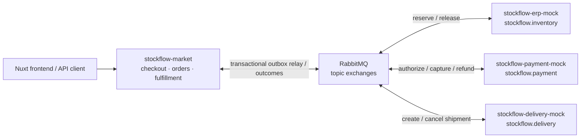
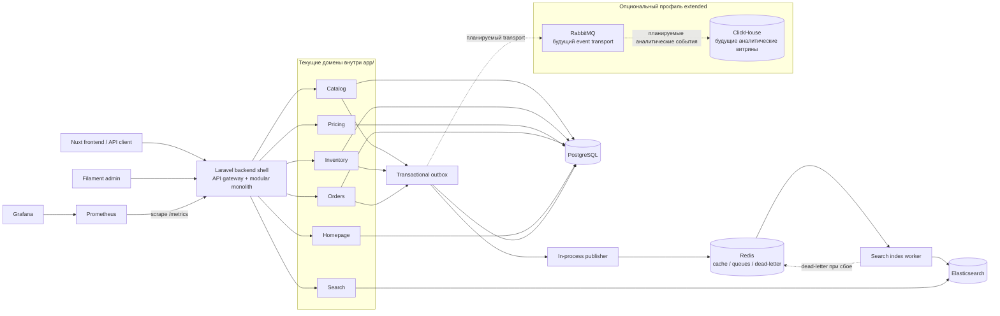

# StockFlow Market

StockFlow Market — инженерный pet-проект маркетплейса с микросервисным направлением вокруг Laravel, PostgreSQL, Redis, RabbitMQ, Elasticsearch, ClickHouse и заготовки Nuxt SSR frontend. Проект развивается как highload-oriented backend case: в нём последовательно прорабатываются каталог, остатки, заказы, цены, поиск, асинхронные события и локальная инфраструктура. Сейчас это фундамент и набор сквозных backend-срезов, а не завершённая production-система или готовый микросервисный маркетплейс.

## Экосистема StockFlow

`stockflow-market` — основной репозиторий и landing page экосистемы. Вокруг него
подготовлены три независимых sandbox-сервиса для интеграции через RabbitMQ:

| Репозиторий | RabbitMQ exchange | Ответственность |
| --- | --- | --- |
| **[stockflow-market](https://github.com/Smiley-Alyx/stockflow-market)** | orchestration boundary | Checkout, заказы, каталог и оркестрация provider-событий |
| [stockflow-erp-mock](https://github.com/Smiley-Alyx/stockflow-erp-mock) | `stockflow.inventory` | Резервирование и освобождение складских остатков |
| [stockflow-payment-mock](https://github.com/Smiley-Alyx/stockflow-payment-mock) | `stockflow.payment` | Авторизация, capture и refund платежей |
| [stockflow-delivery-mock](https://github.com/Smiley-Alyx/stockflow-delivery-mock) | `stockflow.delivery` | Создание, отмена и изменение статуса отправлений |



Моки реализуют версионированные AsyncAPI-контракты, idempotency, retry, DLQ,
failure injection и correlation headers. В `stockflow-market` provider saga
публикует requests через transactional outbox relay, дедуплицирует outcomes через
inbox и выполняет компенсации release, refund и shipment cancel.

| Документ | Содержание |
| --- | --- |
| [`docs/architecture.md`](docs/architecture.md) | Контекст четырёх систем, границы интеграции и trade-offs |
| [`docs/delivery-flow.md`](docs/delivery-flow.md) | Сквозной checkout sequence и компенсирующие действия |
| [`docs/failure-modes.md`](docs/failure-modes.md) | Failure scenarios и таблица гарантий |
| [`docs/provider-outcome-dlq-runbook.md`](docs/provider-outcome-dlq-runbook.md) | Поиск, диагностика и requeue provider outcome DLQ |
| [`docs/demo.md`](docs/demo.md) | Пятиминутный сценарий демонстрации техлиду |

## Текущий статус

Сейчас проект находится на этапе закладки фундамента:

- поднят Laravel backend shell, который временно выполняет роль API gateway;
- добавлен Docker Compose для локального запуска инфраструктуры;
- заведён `services/` workspace под будущие сервисы;
- зафиксированы первые OpenAPI-заготовки и события по доменам;
- реализована модель Catalog: категории, товары, атрибуты, кешируемая read-модель и команда перестроения проекций;
- добавлена Filament-панель для управления каталогом, складами, остатками, ценами и промокодами;
- добавлены настраиваемые блоки главной страницы: рекомендации, хиты, новинки, описание, города и баннеры с управляемым порядком;
- склады дополнены координатами для списка городов и точек на карте;
- добавлена внутренняя публикация `catalog.product.created`;
- добавлен обработчик, который превращает создание товара в `search.index.requested`;
- добавлен первый async job pipeline для индексации поисковых документов;
- добавлены Docker Compose worker-процессы для общей очереди, поисковой индексации и scheduler;
- добавлены `health/live` и `health/ready` probes для runtime и зависимостей;
- подключён Elasticsearch adapter для записи поисковых документов;
- добавлен первый search read endpoint поверх Elasticsearch для индексированных товаров;
- добавлен локальный ClickHouse для будущих аналитических read-моделей и событийных витрин;
- реализован checkout-срез `cart → draft order → price snapshot → async inventory reservation → paid / cancelled / expired`;
- добавлена provider saga `reserve → authorize → capture → shipment` с outbox relay, inbox-дедупликацией и компенсациями;
- добавлены маршрутизация резервов по складам, архивирование складских движений и географический фильтр остатков;
- цены поддерживают городские переопределения, версии, интервалы активности и промокоды; заказ сохраняет снимок выбранной цены и скидки;
- добавлена scheduled-команда истечения активных inventory-резервов с метрикой количества истёкших резервов;
- добавлена операционная команда `search:dead-letter` для просмотра и ручного возврата документов поисковой индексации из отдельного dead-letter backend;
- поиск умеет возвращать деградированный ответ при недоступности Elasticsearch;
- добавлен Prometheus-compatible `/metrics` endpoint и локальный Prometheus/Grafana стек для latency, очередей, dead-letter, reservation conflicts, saga outcomes, компенсаций и stale messaging claims;
- добавлен `config/stockflow.php` для runtime-настроек таймаутов, кеша, очередей, retry и backpressure limits;
- описан первый ADR по переходной архитектуре Laravel gateway + service workspace;
- добавлен архитектурный тест, который проверяет наличие сервисной структуры.

## Архитектура

Целевое направление — микросервисный marketplace, где каждый сервис владеет своей моделью, контрактами и схемой данных. На раннем этапе реализация остаётся в одном репозитории, чтобы быстрее развивать сценарии и не платить стоимость распределённой системы до появления реальной доменной нагрузки.



```text
stockflow-market/
  app/                    # Laravel backend shell / gateway на текущем этапе
  services/
    gateway/              # внешний API слой
    catalog/              # товары, категории, атрибуты
    inventory/            # остатки, резервы, складские движения
    orders/               # корзина и жизненный цикл заказа
    pricing/              # цены, промо-правила, расчёты
    search/               # Elasticsearch индексы и read-модели
  docker/
    php/                  # локальный PHP runtime
  compose.yaml            # локальный стек разработки
```

Каждый доменный сервис уже содержит одинаковые рабочие зоны:

- `contracts/` — OpenAPI и внешние контракты;
- `database/migrations/` — будущая схема данных сервиса;
- `messaging/` — входящие и исходящие события;
- `src/` — прикладной и доменный код;
- `tests/` — модульные, контрактные и интеграционные проверки.

## Локальная инфраструктура

Базовый `docker compose up` поднимает только компоненты, для которых уже есть демонстрируемые сценарии. RabbitMQ и ClickHouse вынесены в опциональный профиль `extended`: они нужны для дальнейшего развития межсервисных событий и аналитических витрин, но пока не являются обязательными зависимостями рабочего backend-среза.

| Сервис | Назначение | Режим запуска | Локальный адрес |
| --- | --- | --- | --- |
| `php` | Laravel backend shell | базовый | `http://localhost:8080` |
| `frontend` | Nuxt SSR dev server | базовый | `http://localhost:3000` |
| `postgres` | основная реляционная БД | базовый | `localhost:5432` |
| `redis` | кеш, сессии, очереди | базовый | `localhost:6379` |
| `elasticsearch` | поисковый движок | базовый | `http://localhost:9200` |
| `prometheus` | сбор метрик gateway | базовый | `http://localhost:9090` |
| `grafana` | дашборды наблюдаемости | базовый | `http://localhost:3001` |
| `rabbitmq` | transport provider saga и будущих доменных событий | `extended` | `localhost:5672`, UI `http://localhost:15672` |
| `clickhouse` | будущие аналитические витрины | `extended` | HTTP `http://localhost:8123`, native `localhost:9000` |

## Сценарии инфраструктуры

| Компонент | Демонстрируемый сценарий | Статус |
| --- | --- | --- |
| PostgreSQL | транзакционные данные каталога, складов, цен, корзин, заказов, outbox и inbox | используется |
| Redis | кеш каталога, Laravel queues, сессии и search dead-letter storage | используется |
| Elasticsearch | индексация каталога, поисковый read endpoint и деградированный ответ при недоступности | используется |
| Prometheus | scrape `/metrics` с latency, очередями, конфликтами резервов и ошибками индексации | используется |
| Grafana | автоматически provisioned dashboard `StockFlow Observability` поверх Prometheus | используется |
| RabbitMQ | provider outbox relay, outcome consumer и circuit breaker; открытый circuit оставляет события в outbox | профиль `extended`, используется provider saga |
| ClickHouse | опциональная readiness-проверка и локальное хранилище для будущих аналитических read-моделей | профиль `extended`, проекция ещё не реализована |

Расширенный профиль запускается явно:

```bash
RABBITMQ_ENABLED=true CLICKHOUSE_ENABLED=true docker compose --profile extended up -d
```

Backend использует in-process публикацию общих доменных outbox-событий по умолчанию. Переменная `STOCKFLOW_EVENT_BUS=rabbitmq` пока включает для них только circuit-breaker границу для тестирования поведения outbox при недоступности будущего transport, но не отправляет эти сообщения в RabbitMQ. Provider saga использует отдельный RabbitMQ transport для request-событий и outcomes.

Все четыре репозитория можно поднять на одном RabbitMQ одной командой:

```bash
docker compose -f docker-compose-all.yml up -d --build
```

В общем стенде gateway остаётся на `http://localhost:8080`, payment mock доступен
на `http://localhost:8081`, delivery mock — на `http://localhost:8082`, ERP mock —
на `http://localhost:8083`. Подробности и команды проверки собраны в
[`docs/demo.md`](docs/demo.md).

Автономный broker-level E2E тест поднимает market, три provider mock и RabbitMQ,
прогоняет один checkout и останавливает созданные контейнеры:

```bash
./scripts/test-broker-checkout-e2e.sh
```

Воспроизводимый сценарий `создать товар → событие → индексация → поиск → dead-letter/requeue` описан в [`docs/catalog-demo.md`](docs/catalog-demo.md).

Законченный бизнес-сценарий `корзина → price snapshot → reserve stock → order created` описан в [`docs/checkout-demo.md`](docs/checkout-demo.md).

Минимальные примеры API через `curl` и `httpie` собраны в [`docs/api-examples.md`](docs/api-examples.md).

Дефолтные локальные креды:

```text
PostgreSQL: stockflow / secret
RabbitMQ:   stockflow / secret
ClickHouse: stockflow / secret
```

Общий стенд из `docker-compose-all.yml` использует для RabbitMQ креды
`stockflow / stockflow`, одинаковые для marketplace и трёх моков.

## Быстрый старт

```bash
cp .env.example .env
docker compose up -d --build
docker compose exec php composer install
docker compose exec php php artisan key:generate
docker compose exec php php artisan migrate
```

После базового запуска:

- backend доступен на `http://localhost:8080`;
- frontend доступен на `http://localhost:3000`;
- Prometheus доступен на `http://localhost:9090`;
- Grafana доступна на `http://localhost:3001` с кредами `stockflow / stockflow`.

После запуска профиля `extended` RabbitMQ Management UI доступен на `http://localhost:15672`.

## Локальные команды

```bash
composer install-git-hooks
composer test
docker compose config
docker compose ps
docker compose logs -f php
docker compose down
```

`composer test` запускает локальный PHP, если есть подходящий PDO-драйвер. При наличии `pdo_sqlite` используется in-memory SQLite; если локально доступен только `pdo_pgsql`, тесты переключаются на PostgreSQL с дефолтными локальными кредами `stockflow / secret`. Если локальный PHP не подходит, wrapper запускает suite внутри `docker compose run php`.

`composer install-git-hooks` включает проектные git hooks и шаблон commit message. Commit message обязан соответствовать conventional commits в формате `type(scope): subject`, где `scope` обязателен и пишется в kebab-case.

Примеры:

- `feat(order-matching): introduce async matching pipeline`
- `refactor(cache): extract redis abstraction layer`
- `perf(ws): reduce allocations in market broadcast loop`
- `test(load): add k6 scenario for burst traffic`
- `docs(adr): describe event-driven matching architecture`
- `infra(observability): add prometheus and grafana stack`

## Runtime-настройки

Проектные highload-oriented настройки собраны в `config/stockflow.php`, чтобы прикладной код не хардкодил операционные лимиты. Значения переопределяются через `STOCKFLOW_*` переменные в `.env`.

| Группа | Назначение |
| --- | --- |
| `runtime` | имя сервиса, общий request timeout, graceful shutdown budget |
| `dependencies` | адреса RabbitMQ, Elasticsearch и ClickHouse для health checks и адаптеров |
| `catalog.cache` | TTL кеша товаров и дерева категорий |
| `search.indexing` | очередь индексации, Redis dead-letter backend, requeue audit channel, batch size, max in-flight, timeout Elasticsearch |
| `messaging.retry` | retry attempts, backoff и порог dead-letter |

Эти настройки задают операционные границы для кеша каталога, Elasticsearch adapter, retries и backpressure. Очередь `search-indexing` уже используется job pipeline для поисковой индексации, а окончательно упавшие документы сохраняются в Redis-backed dead-letter storage с operational name `search-indexing-dead-letter`.

## Наблюдаемость

Gateway отдаёт Prometheus text exposition на:

```bash
curl http://localhost:8080/metrics
```

Локальный Prometheus scrape-ит endpoint `php:8000/metrics` каждые 15 секунд. Grafana автоматически подхватывает datasource `Prometheus` и dashboard `StockFlow Observability`.

Экспортируемые метрики:

| Метрика | Тип | Назначение |
| --- | --- | --- |
| `stockflow_http_request_duration_seconds` | histogram | latency по HTTP method, route endpoint и status |
| `stockflow_queue_depth` | gauge | глубина очередей `default` и `search-indexing` |
| `stockflow_search_dead_letter_count` | gauge | количество документов в search indexing dead-letter |
| `stockflow_inventory_reservation_conflicts_total` | counter | конфликты резервирования по причине `idempotency` / `insufficient_stock` |
| `stockflow_search_indexing_failures_total` | counter | окончательные ошибки Elasticsearch indexing/delete по index и operation |

Dashboard содержит панели для p95 latency по endpoint, глубины очередей, dead-letter count, reservation conflicts rate и Elasticsearch indexing failures rate. Эти метрики покрывают текущий async pipeline и дают базу для будущих alert rules по росту dead-letter, очередей и latency.

## Search dead-letter операции

Документы, которые не удалось проиндексировать после retry-порога, сохраняются в Redis-backed dead-letter хранилище. Это приближает локальный контур к production-подобному операционному сценарию, но не заменяет проверку под реальной нагрузкой и отказами. По умолчанию используется ключ `stockflow:search:dead-letter`; CLI-контракт остаётся прежним: оператор работает с числовым `ID`, фильтрами и теми же action `list` / `requeue`.

```bash
php artisan search:dead-letter list
php artisan search:dead-letter list --limit=50
php artisan search:dead-letter list --index=catalog_products --document-id=15
```

Возврат одного документа в основную очередь индексации:

```bash
php artisan search:dead-letter requeue --id=123
```

Защищённый bulk requeue для production-подобных сценариев:

```bash
php artisan search:dead-letter requeue --all --index=catalog_products --dry-run
php artisan search:dead-letter requeue --all --index=catalog_products --document-id=15 --dry-run
php artisan search:dead-letter requeue --all --index=catalog_products
php artisan search:dead-letter requeue --all --index=catalog_products --force
php artisan search:dead-letter requeue --all --index=catalog_products --batch-size=50 --force
```

Защитные правила:

- `requeue` требует `--id` или явный `--all`;
- `--dry-run` показывает найденные документы и не меняет очереди;
- bulk requeue без `--force` требует интерактивного подтверждения;
- bulk requeue обрабатывает документы страницами по `ID` и чанками не больше `STOCKFLOW_SEARCH_MAX_REQUEUE_BATCH_SIZE`;
- `--index` и `--document-id` сужают выборку перед requeue;
- каждый реально возвращённый документ пишет структурированное audit-событие `search.dead_letter.requeued` в канал `STOCKFLOW_SEARCH_REQUEUE_AUDIT_CHANNEL`, чтобы его можно было отдельно направлять в SIEM.

## Inventory reservation expiry

Активные резервы остатков истекают через scheduled job. В локальном Docker Compose за это отвечает сервис `scheduler`, который запускает Laravel scheduler через `php artisan schedule:work`. Scheduler каждую минуту выполняет:

```bash
php artisan inventory:reservations:expire
```

Команду можно запускать вручную для операционной проверки или разовой очистки. После каждого запуска она пишет структурированное log-событие `inventory.reservations.expired` с полем `expired_count`, чтобы количество истёкших резервов можно было собирать как метрику.

## Проверки

Основная проверка на текущем этапе:

```bash
composer test
```

GitHub Actions workflow `.github/workflows/ci.yml` запускает `composer test`, `vendor/bin/pint --test` и `docker compose config --quiet` для каждого push и pull request.

Тесты страхуют базовый Laravel bootstrap, runtime-конфигурацию, сервисную структуру, модель и проекции каталога, OpenAPI-контракты, HTTP read API, блоки главной страницы, цены и промокоды, checkout-срез с резервированием остатков и поисковый indexing pipeline, включая retry/dead-letter поведение и ручной requeue.

## Нагрузочные сценарии

k6-сценарии лежат в `tests/load/k6` и покрывают массовый просмотр каталога, конкурентное резервирование одного SKU, поисковые запросы и checkout burst:

```bash
k6 run tests/load/k6/stockflow.js
```

Сценарии используют `BASE_URL=http://localhost:8080` по умолчанию. Для стабильного прогона на подготовленной базе можно явно передать `RESERVATION_SKU`, `CHECKOUT_PRODUCT_ID` и `SEARCH_QUERIES`; полный список параметров описан в `tests/load/k6/README.md`.

Зафиксированный локальный baseline с условиями запуска, метриками и ограничениями интерпретации: [`tests/load/k6/results/2026-06-01-local-baseline.md`](tests/load/k6/results/2026-06-01-local-baseline.md).

## Инженерные решения

- Репозиторий остаётся monorepo, пока сервисы находятся в активной фазе проектирования.
- Переходная архитектура зафиксирована в `docs/adr/0001-laravel-gateway-service-workspace.md`.
- Runtime-настройки зафиксированы в `docs/adr/0002-runtime-configuration-boundaries.md`.
- PostgreSQL выбран как основное хранилище для транзакционных данных.
- Redis используется для кеша, сессий и быстрых очередей локального контура.
- RabbitMQ зарезервирован под доменные события между сервисами.
- Elasticsearch выделен под поисковые read-модели и индексацию каталога.
- ClickHouse выделен под будущие аналитические read-модели и событийные витрины.
- Контракты сервисов описываются до реализации публичных API.

## Ближайший план

1. Добавить async-проекцию статусов резервирования поверх брокера вместо текущего in-process gateway path.
2. Подключить RabbitMQ transport для межсервисных событий и проверить сценарии повторной доставки.
3. Добавить alert rules для Prometheus по росту dead-letter, очередей и latency.

## Лицензия

MIT.
