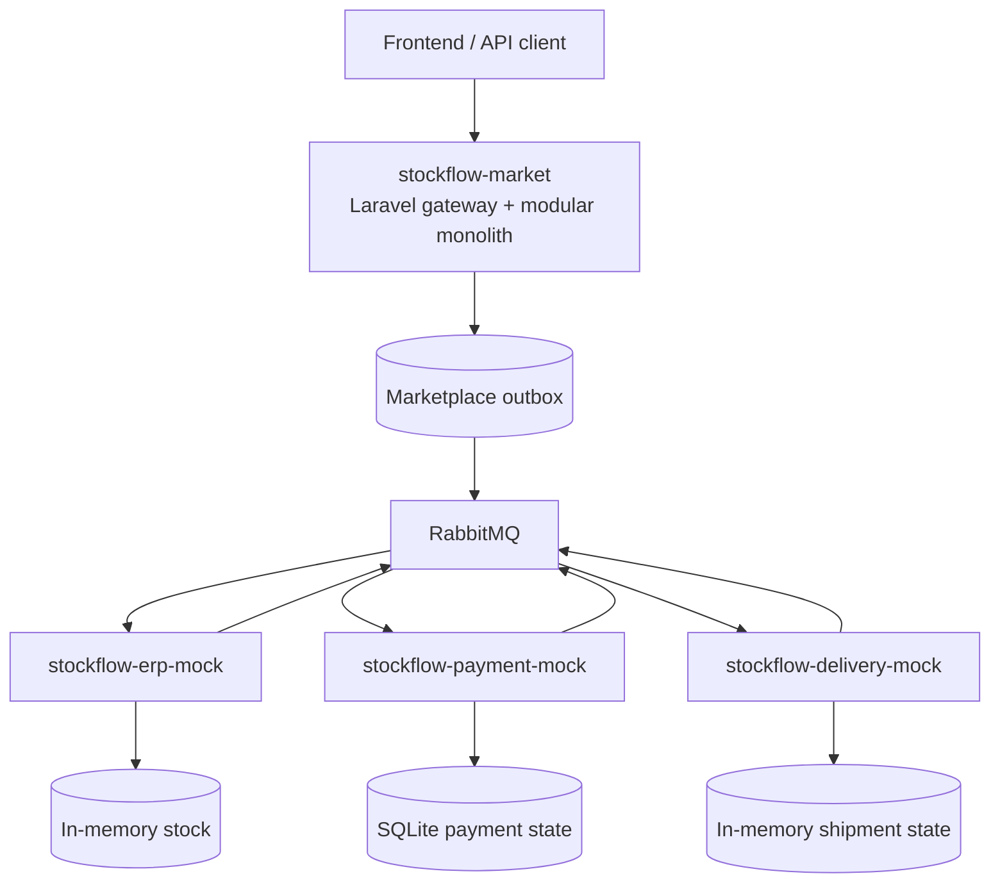

# Архитектура экосистемы StockFlow

## Контекст

StockFlow состоит из основного marketplace-репозитория и трёх sandbox-сервисов,
которые моделируют внешние provider boundaries:

| Репозиторий | Роль | Контракт |
| --- | --- | --- |
| [stockflow-market](https://github.com/Smiley-Alyx/stockflow-market) | Checkout, orders, fulfillment orchestration | HTTP API и внутренний outbox |
| [stockflow-erp-mock](https://github.com/Smiley-Alyx/stockflow-erp-mock) | ERP/WMS: reserve и release остатков | [`contracts/asyncapi.yaml`](https://github.com/Smiley-Alyx/stockflow-erp-mock/blob/main/contracts/asyncapi.yaml) |
| [stockflow-payment-mock](https://github.com/Smiley-Alyx/stockflow-payment-mock) | PSP: authorize, capture, refund | [`contracts/asyncapi.yaml`](https://github.com/Smiley-Alyx/stockflow-payment-mock/blob/main/contracts/asyncapi.yaml) |
| [stockflow-delivery-mock](https://github.com/Smiley-Alyx/stockflow-delivery-mock) | Carrier: create, cancel, status update | [`contracts/asyncapi.yaml`](https://github.com/Smiley-Alyx/stockflow-delivery-mock/blob/main/contracts/asyncapi.yaml) |

## Текущее состояние интеграции

Provider sandbox-сервисы готовы к автономному запуску и ручному контрактному
тестированию через общий
RabbitMQ. Они объявляют topic exchanges, входящие очереди, retry queues и DLQ.

В `stockflow-market` реализованы draft order, price snapshot, checkout
configuration и lifecycle заказа. Provider saga публикует
inventory/payment/delivery requests через transactional outbox relay, потребляет
outcomes через inbox-дедупликацию и проецирует статусы резервов в checkout
read-модель.

Общие доменные события проходят через transactional outbox и topic exchange
`stockflow.domain.events`. Market consumer использует inbox для защиты от
повторной доставки, TTL retry queue и отдельную DLQ. Детали transport описаны в
[`domain-event-transport.md`](domain-event-transport.md).

Это разделяет два уровня демонстрации:

| Уровень | Что работает сейчас |
| --- | --- |
| Marketplace slice | HTTP checkout и асинхронная read-модель резервов |
| Provider sandbox | RabbitMQ-контракты, retries, DLQ, idempotency и failure injection в каждом sandbox-сервисе |
| End-to-end orchestration | Реализованы market publisher, outcome consumer, saga state и компенсации |

## Целевая оркестрация checkout

Marketplace хранит saga state по `order_id` и выполняет шаги
последовательно:

1. Опубликовать `inventory.reservation.requested.v1`.
2. После всех `inventory.reservation.confirmed.v1` подтвердить заказ и
   опубликовать `payment.authorization.requested.v1`.
3. Проецировать каждый reservation outcome для checkout read endpoint.
4. Опубликовать `payment.capture.requested.v1`.
5. После `payment.capture.completed.v1` опубликовать
   `delivery.shipment.requested.v1`.

Полная диаграмма и компенсации описаны в
[`delivery-flow.md`](delivery-flow.md).

## Общий message envelope

Границы используют одинаковую идею трассировки, хотя точный JSON envelope
зафиксирован в контракте каждого sandbox-сервиса:

| Поле | Назначение |
| --- | --- |
| `message_id` | Уникальный идентификатор сообщения |
| `correlation_id` | Один идентификатор на весь checkout |
| `causation_id` | Идентификатор сообщения, породившего текущее |
| `idempotency_key` | Стабильный ключ дедупликации side effect |
| `occurred_at` | UTC timestamp |
| `schema_version` | Версия схемы payload |

## Локальный deployment

[`docker-compose-all.yml`](../docker-compose-all.yml) поднимает market,
инфраструктуру и три provider sandbox-сервиса на одном broker:

| Компонент | Адрес |
| --- | --- |
| Market gateway | `http://localhost:8080` |
| Payment sandbox | `http://localhost:8081` |
| Delivery sandbox | `http://localhost:8082` |
| ERP sandbox | `http://localhost:8083` |
| RabbitMQ UI | `http://localhost:15672` |

ERP использует `8083` только в общем стенде: в собственном compose репозитория он
остаётся на `8080`.

## Компромиссы

| Решение | Плюсы | Ограничения |
| --- | --- | --- |
| Независимые provider sandbox-репозитории | Видны реальные provider boundaries и отдельные контракты | Нужна синхронизация версий контрактов |
| RabbitMQ topic exchanges | Явные routing keys, broker-native retry/DLQ | Требуется consumer idempotency и операционная работа с DLQ |
| Saga orchestration в market | Проще видеть бизнес-порядок checkout | Market хранит orchestration state и компенсации |
| In-memory state в ERP и delivery | Быстрые локальные демо и fault injection | State теряется при рестарте, multi-instance режим не поддержан |
| SQLite state в payment sandbox | Повторяемый локальный ledger без отдельной БД | Не моделирует production-конкурентность PostgreSQL |

## Следующий этап реализации

Для усиления end-to-end checkout нужны:

1. Grafana-панели и alert thresholds для saga outcomes, компенсаций и stale claim recovery.

Runbook для разбора и повторной постановки provider outcome DLQ находится в
[`provider-outcome-dlq-runbook.md`](provider-outcome-dlq-runbook.md).
