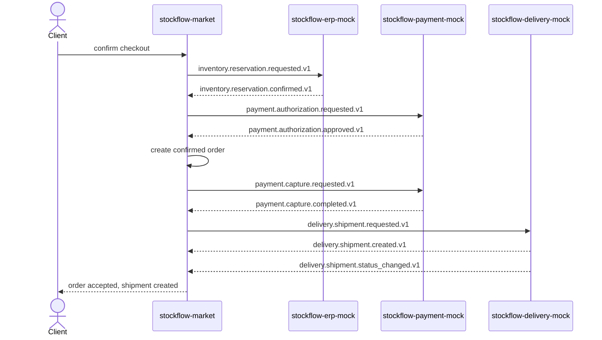
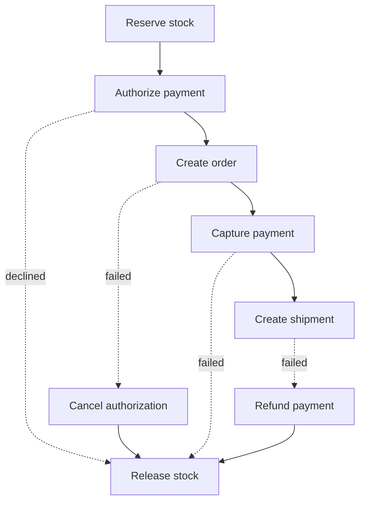
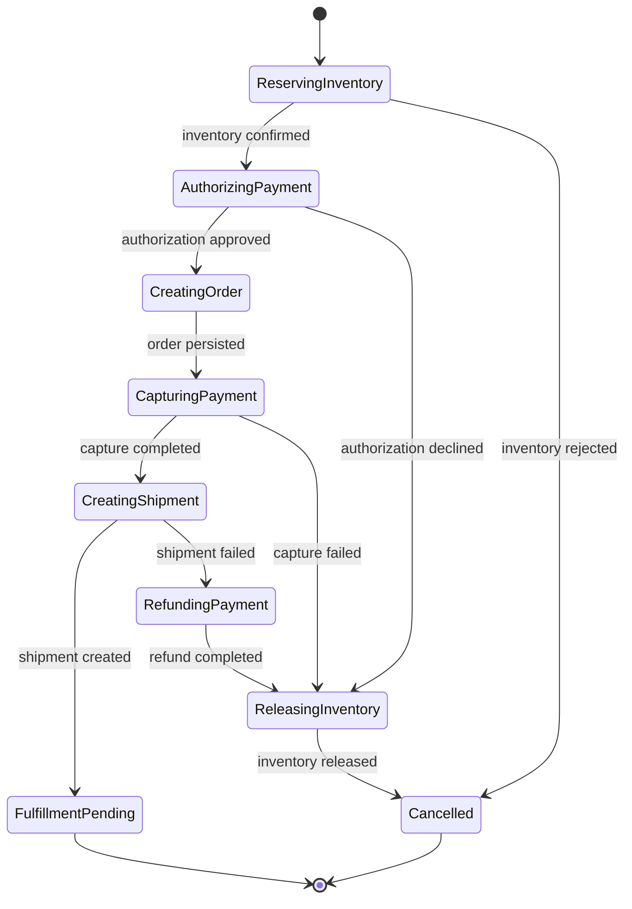

# Сквозной checkout flow

## Happy path

Целевая последовательность checkout:
`reserve stock → authorize payment → create order → capture payment → create shipment`.

Все сообщения одного checkout сохраняют одинаковый `correlation_id`.
`causation_id` связывает каждый outcome с конкретным request.

## Компенсации

Payment mock сейчас поддерживает refund, но отдельного message-контракта void для
не captured authorization нет. До реализации market-orchestrator это нужно
зафиксировать как контрактное решение: добавить void/cancel authorization либо
использовать bounded authorization TTL на стороне PSP.

## Routing keys

| Шаг | Request | Успешный outcome | Негативный outcome |
| --- | --- | --- | --- |
| Reserve stock | `inventory.reservation.requested.v1` | `inventory.reservation.confirmed.v1` | `inventory.reservation.rejected.v1` |
| Release stock | `inventory.reservation.release.requested.v1` | `inventory.reservation.released.v1` | `inventory.reservation.release_failed.v1` |
| Authorize payment | `payment.authorization.requested.v1` | `payment.authorization.approved.v1` | `payment.authorization.declined.v1` |
| Capture payment | `payment.capture.requested.v1` | `payment.capture.completed.v1` | `payment.capture.failed.v1` |
| Refund payment | `payment.refund.requested.v1` | `payment.refund.completed.v1` | `payment.refund.failed.v1` |
| Create shipment | `delivery.shipment.requested.v1` | `delivery.shipment.created.v1` | `delivery.shipment.creation_failed.v1` |
| Cancel shipment | `delivery.shipment.cancel_requested.v1` | `delivery.shipment.cancelled.v1` | `delivery.shipment.cancel_failed.v1` |

## Saga state

Рекомендуемый минимальный state machine market-orchestrator:

Saga transition должен быть idempotent: повторная доставка outcome не меняет
state повторно и не создаёт новый provider request.
