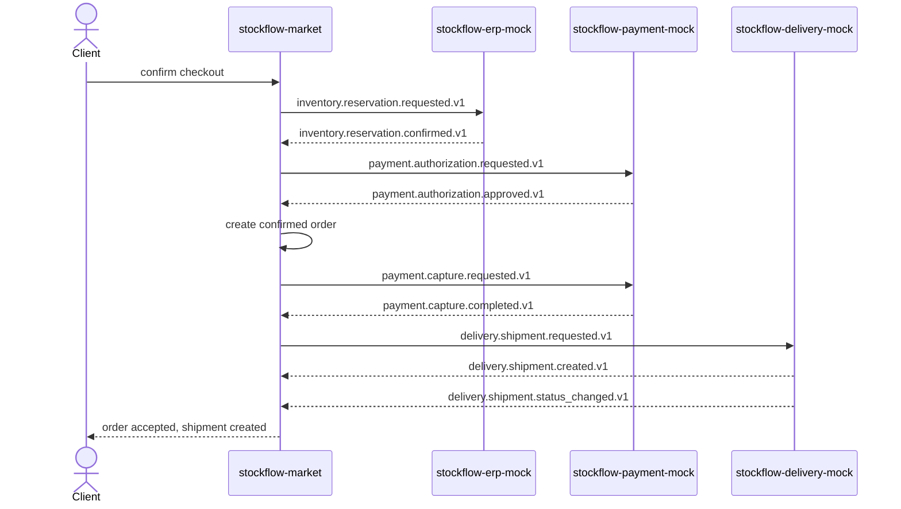
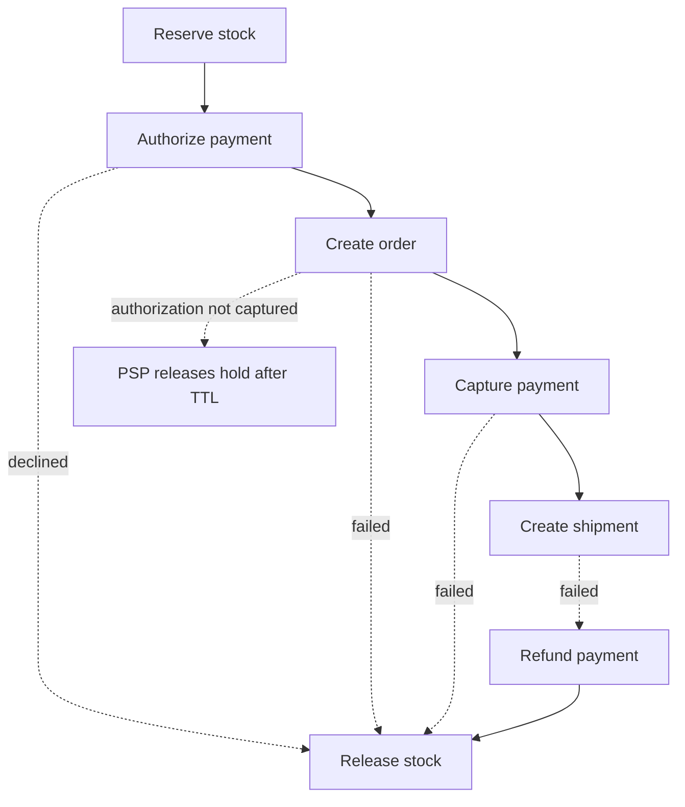

# Сквозной checkout flow

## Happy path

Целевая последовательность checkout:
`reserve stock → authorize payment → create order → capture payment → create shipment`.

Все сообщения одного checkout сохраняют одинаковый `correlation_id`.
`causation_id` связывает каждый outcome с конкретным request.

## Компенсации

### TTL authorization вместо void

Для v1 выбран bounded authorization TTL на стороне PSP. Отдельного
`payment.authorization.void.requested.v1` и outcome-событий void в контракте
нет.

- authorization hold живёт не больше `15 минут` после
  `payment.authorization.approved.v1`;
- если capture не выполнен за это время, PSP автоматически освобождает hold;
- если market обнаружил, что не может продолжить checkout после authorization,
  он должен сразу опубликовать release inventory и не ждать истечения payment
  TTL;
- если задержанный `payment.capture.requested.v1` приходит после истечения TTL,
  PSP отвечает `payment.capture.failed.v1` с причиной истёкшей authorization, а
  market освобождает inventory;
- refund используется только после успешного capture.

Текущий sandbox payment mock освобождает hold при capture failure, но не
моделирует фоновое истечение `15 минут`. Это упрощение sandbox, а не открытый
выбор протокола: production PSP boundary должен гарантировать TTL
не captured authorization.

В текущем market-orchestrator confirmed order и
`payment.capture.requested.v1` записываются в одной DB-транзакции после
authorization outcome. TTL остаётся страховкой provider boundary для
запоздалого capture, внешнего сбоя и будущего выделения order creation в
отдельный шаг.

## Routing keys

| Шаг | Request | Успешный outcome | Негативный outcome |
| --- | --- | --- | --- |
| Reserve stock | `inventory.reservation.requested.v1` | `inventory.reservation.confirmed.v1` | `inventory.reservation.rejected.v1` |
| Release stock | `inventory.reservation.release.requested.v1` | `inventory.reservation.released.v1` | `inventory.reservation.release_failed.v1` |
| Authorize payment | `payment.authorization.requested.v1` | `payment.authorization.approved.v1` | `payment.authorization.declined.v1` |
| Capture payment | `payment.capture.requested.v1` | `payment.capture.completed.v1` | `payment.capture.failed.v1` |
| Refund payment | `payment.refund.requested.v1` | `payment.refund.completed.v1` | `payment.refund.failed.v1` |
| Create shipment | `delivery.shipment.requested.v1` | `delivery.shipment.created.v1` | `delivery.shipment.creation_failed.v1` |
| Cancel shipment | `delivery.shipment.cancel_requested.v1` | `delivery.shipment.cancelled.v1` | `delivery.shipment.cancel_failed.v1` |

## Saga state

Рекомендуемый минимальный state machine market-orchestrator:

```mermaid
stateDiagram-v2
    [*] --> ReservingInventory
    ReservingInventory --> AuthorizingPayment: inventory confirmed
    ReservingInventory --> Cancelled: inventory rejected
    AuthorizingPayment --> CreatingOrder: authorization approved
    AuthorizingPayment --> ReleasingInventory: authorization declined
    CreatingOrder --> CapturingPayment: order persisted
    CreatingOrder --> ReleasingInventory: order failed; authorization expires by PSP TTL
    CapturingPayment --> CreatingShipment: capture completed
    CapturingPayment --> ReleasingInventory: capture failed or authorization TTL expired
    CreatingShipment --> FulfillmentPending: shipment created
    CreatingShipment --> RefundingPayment: shipment failed
    RefundingPayment --> ReleasingInventory: refund completed
    ReleasingInventory --> Cancelled: inventory released
    FulfillmentPending --> [*]
    Cancelled --> [*]
```

Saga transition должен быть idempotent: повторная доставка outcome не меняет
state повторно и не создаёт новый provider request.
